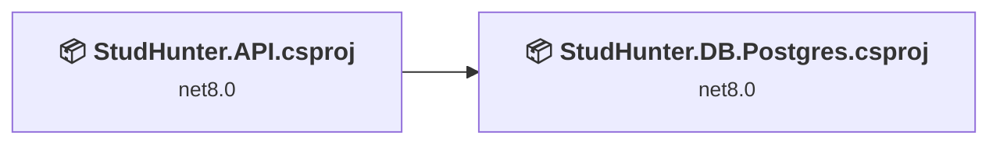
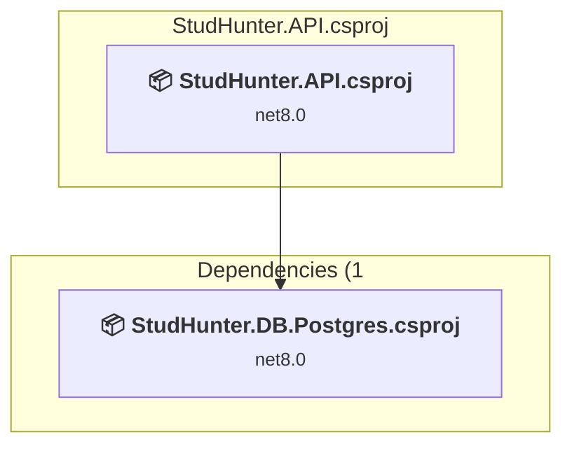
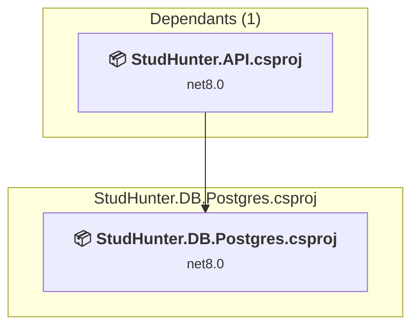

# Projects and dependencies analysis

This document provides a comprehensive overview of the projects and their dependencies in the context of upgrading to .NETCoreApp,Version=v10.0.

## Table of Contents

- [Executive Summary](#executive-Summary)
  - [Highlevel Metrics](#highlevel-metrics)
  - [Projects Compatibility](#projects-compatibility)
  - [Package Compatibility](#package-compatibility)
  - [API Compatibility](#api-compatibility)
- [Aggregate NuGet packages details](#aggregate-nuget-packages-details)
- [Top API Migration Challenges](#top-api-migration-challenges)
  - [Technologies and Features](#technologies-and-features)
  - [Most Frequent API Issues](#most-frequent-api-issues)
- [Projects Relationship Graph](#projects-relationship-graph)
- [Project Details](#project-details)

  - [StudHunter.API\StudHunter.API.csproj](#studhunterapistudhunterapicsproj)
  - [StudHunter.DB.Postgres\StudHunter.DB.Postgres.csproj](#studhunterdbpostgresstudhunterdbpostgrescsproj)

## Executive Summary

### Highlevel Metrics

| Metric | Count | Status |
| :--- | :---: | :--- |
| Total Projects | 2 | All require upgrade |
| Total NuGet Packages | 13 | 8 need upgrade |
| Total Code Files | 190 |  |
| Total Code Files with Incidents | 4 |  |
| Total Lines of Code | 19244 |  |
| Total Number of Issues | 24 |  |
| Estimated LOC to modify | 13+ | at least 0,1% of codebase |

### Projects Compatibility

| Project | Target Framework | Difficulty | Package Issues | API Issues | Est. LOC Impact | Description |
| :--- | :---: | :---: | :---: | :---: | :---: | :--- |
| [StudHunter.API\StudHunter.API.csproj](#studhunterapistudhunterapicsproj) | net8.0 | 🟢 Low | 4 | 13 | 13+ | AspNetCore, Sdk Style = True |
| [StudHunter.DB.Postgres\StudHunter.DB.Postgres.csproj](#studhunterdbpostgresstudhunterdbpostgrescsproj) | net8.0 | 🟢 Low | 5 | 0 |  | ClassLibrary, Sdk Style = True |

### Package Compatibility

| Status | Count | Percentage |
| :--- | :---: | :---: |
| ✅ Compatible | 5 | 38,5% |
| ⚠️ Incompatible | 0 | 0,0% |
| 🔄 Upgrade Recommended | 8 | 61,5% |
| ***Total NuGet Packages*** | ***13*** | ***100%*** |

### API Compatibility

| Category | Count | Impact |
| :--- | :---: | :--- |
| 🔴 Binary Incompatible | 5 | High - Require code changes |
| 🟡 Source Incompatible | 7 | Medium - Needs re-compilation and potential conflicting API error fixing |
| 🔵 Behavioral change | 1 | Low - Behavioral changes that may require testing at runtime |
| ✅ Compatible | 22990 |  |
| ***Total APIs Analyzed*** | ***23003*** |  |

## Aggregate NuGet packages details

| Package | Current Version | Suggested Version | Projects | Description |
| :--- | :---: | :---: | :--- | :--- |
| BCrypt.Net-Next | 4.0.3 |  | [StudHunter.API.csproj](#studhunterapistudhunterapicsproj) | ✅Compatible |
| Microsoft.AspNetCore.Authentication.JwtBearer | 8.0.19 | 10.0.1 | [StudHunter.API.csproj](#studhunterapistudhunterapicsproj) | Рекомендуется обновить пакет NuGet |
| Microsoft.EntityFrameworkCore | 9.0.8 | 10.0.1 | [StudHunter.DB.Postgres.csproj](#studhunterdbpostgresstudhunterdbpostgrescsproj) | Рекомендуется обновить пакет NuGet |
| Microsoft.EntityFrameworkCore.Design | 9.0.8 | 10.0.1 | [StudHunter.API.csproj](#studhunterapistudhunterapicsproj) [StudHunter.DB.Postgres.csproj](#studhunterdbpostgresstudhunterdbpostgrescsproj) | Рекомендуется обновить пакет NuGet |
| Microsoft.EntityFrameworkCore.Tools | 9.0.8 | 10.0.1 | [StudHunter.API.csproj](#studhunterapistudhunterapicsproj) | Рекомендуется обновить пакет NuGet |
| Microsoft.Extensions.Configuration | 9.0.8 | 10.0.1 | [StudHunter.DB.Postgres.csproj](#studhunterdbpostgresstudhunterdbpostgrescsproj) | Рекомендуется обновить пакет NuGet |
| Microsoft.Extensions.Configuration.FileExtensions | 9.0.8 | 10.0.1 | [StudHunter.DB.Postgres.csproj](#studhunterdbpostgresstudhunterdbpostgrescsproj) | Рекомендуется обновить пакет NuGet |
| Microsoft.Extensions.Configuration.Json | 9.0.8 | 10.0.1 | [StudHunter.DB.Postgres.csproj](#studhunterdbpostgresstudhunterdbpostgrescsproj) | Рекомендуется обновить пакет NuGet |
| Microsoft.VisualStudio.Web.CodeGeneration.Design | 9.0.0 | 10.0.0 | [StudHunter.API.csproj](#studhunterapistudhunterapicsproj) | Рекомендуется обновить пакет NuGet |
| Npgsql.EntityFrameworkCore.PostgreSQL | 9.0.4 |  | [StudHunter.DB.Postgres.csproj](#studhunterdbpostgresstudhunterdbpostgrescsproj) | ✅Compatible |
| Swashbuckle.AspNetCore | 8.1.4 |  | [StudHunter.API.csproj](#studhunterapistudhunterapicsproj) | ✅Compatible |
| Swashbuckle.AspNetCore.SwaggerUI | 9.0.3 |  | [StudHunter.API.csproj](#studhunterapistudhunterapicsproj) | ✅Compatible |
| System.IdentityModel.Tokens.Jwt | 8.14.0 |  | [StudHunter.API.csproj](#studhunterapistudhunterapicsproj) | ✅Compatible |

## Top API Migration Challenges

### Technologies and Features

| Technology | Issues | Percentage | Migration Path |
| :--- | :---: | :---: | :--- |
| IdentityModel & Claims-based Security | 5 | 38,5% | Windows Identity Foundation (WIF), SAML, and claims-based authentication APIs that have been replaced by modern identity libraries. WIF was the original identity framework for .NET Framework. Migrate to Microsoft.IdentityModel.* packages (modern identity stack). |

### Most Frequent API Issues

| API | Count | Percentage | Category |
| :--- | :---: | :---: | :--- |
| T:Microsoft.AspNetCore.Authentication.JwtBearer.JwtBearerDefaults | 2 | 15,4% | Source Incompatible |
| F:Microsoft.AspNetCore.Authentication.JwtBearer.JwtBearerDefaults.AuthenticationScheme | 2 | 15,4% | Source Incompatible |
| T:System.IdentityModel.Tokens.Jwt.JwtSecurityTokenHandler | 1 | 7,7% | Binary Incompatible |
| M:System.IdentityModel.Tokens.Jwt.JwtSecurityTokenHandler.#ctor | 1 | 7,7% | Binary Incompatible |
| M:System.IdentityModel.Tokens.Jwt.JwtSecurityTokenHandler.WriteToken(Microsoft.IdentityModel.Tokens.SecurityToken) | 1 | 7,7% | Binary Incompatible |
| T:System.IdentityModel.Tokens.Jwt.JwtSecurityToken | 1 | 7,7% | Binary Incompatible |
| M:System.IdentityModel.Tokens.Jwt.JwtSecurityToken.#ctor(System.String,System.String,System.Collections.Generic.IEnumerable{System.Security.Claims.Claim},System.Nullable{System.DateTime},System.Nullable{System.DateTime},Microsoft.IdentityModel.Tokens.SigningCredentials) | 1 | 7,7% | Binary Incompatible |
| P:Microsoft.AspNetCore.Authentication.JwtBearer.JwtBearerOptions.TokenValidationParameters | 1 | 7,7% | Source Incompatible |
| T:Microsoft.Extensions.DependencyInjection.JwtBearerExtensions | 1 | 7,7% | Source Incompatible |
| M:Microsoft.Extensions.DependencyInjection.JwtBearerExtensions.AddJwtBearer(Microsoft.AspNetCore.Authentication.AuthenticationBuilder,System.Action{Microsoft.AspNetCore.Authentication.JwtBearer.JwtBearerOptions}) | 1 | 7,7% | Source Incompatible |
| M:Microsoft.Extensions.Logging.ConsoleLoggerExtensions.AddConsole(Microsoft.Extensions.Logging.ILoggingBuilder) | 1 | 7,7% | Behavioral Change |

## Projects Relationship Graph

Legend:
📦 SDK-style project
⚙️ Classic project

```mermaid
flowchart LR
    P1["<b>📦&nbsp;StudHunter.DB.Postgres.csproj</b><br/><small>net8.0</small>"]
    P2["<b>📦&nbsp;StudHunter.API.csproj</b><br/><small>net8.0</small>"]
    P2 --> P1
    click P1 "#studhunterdbpostgresstudhunterdbpostgrescsproj"
    click P2 "#studhunterapistudhunterapicsproj"

```

## Project Details

### StudHunter.API\StudHunter.API.csproj

#### Project Info

- **Current Target Framework:** net8.0
- **Proposed Target Framework:** net10.0
- **SDK-style**: True
- **Project Kind:** AspNetCore
- **Dependencies**: 1
- **Dependants**: 0
- **Number of Files**: 138
- **Number of Files with Incidents**: 3
- **Lines of Code**: 9032
- **Estimated LOC to modify**: 13+ (at least 0,1% of the project)

#### Dependency Graph

Legend:
📦 SDK-style project
⚙️ Classic project

```mermaid
flowchart TB
    subgraph current["StudHunter.API.csproj"]
        MAIN["<b>📦&nbsp;StudHunter.API.csproj</b><br/><small>net8.0</small>"]
        click MAIN "#studhunterapistudhunterapicsproj"
    end
    subgraph downstream["Dependencies (1"]
        P1["<b>📦&nbsp;StudHunter.DB.Postgres.csproj</b><br/><small>net8.0</small>"]
        click P1 "#studhunterdbpostgresstudhunterdbpostgrescsproj"
    end
    MAIN --> P1

```

### API Compatibility

| Category | Count | Impact |
| :--- | :---: | :--- |
| 🔴 Binary Incompatible | 5 | High - Require code changes |
| 🟡 Source Incompatible | 7 | Medium - Needs re-compilation and potential conflicting API error fixing |
| 🔵 Behavioral change | 1 | Low - Behavioral changes that may require testing at runtime |
| ✅ Compatible | 9907 |  |
| ***Total APIs Analyzed*** | ***9920*** |  |

#### Project Technologies and Features

| Technology | Issues | Percentage | Migration Path |
| :--- | :---: | :---: | :--- |
| IdentityModel & Claims-based Security | 5 | 38,5% | Windows Identity Foundation (WIF), SAML, and claims-based authentication APIs that have been replaced by modern identity libraries. WIF was the original identity framework for .NET Framework. Migrate to Microsoft.IdentityModel.* packages (modern identity stack). |

### StudHunter.DB.Postgres\StudHunter.DB.Postgres.csproj

#### Project Info

- **Current Target Framework:** net8.0
- **Proposed Target Framework:** net10.0
- **SDK-style**: True
- **Project Kind:** ClassLibrary
- **Dependencies**: 0
- **Dependants**: 1
- **Number of Files**: 54
- **Number of Files with Incidents**: 1
- **Lines of Code**: 10212
- **Estimated LOC to modify**: 0+ (at least 0,0% of the project)

#### Dependency Graph

Legend:
📦 SDK-style project
⚙️ Classic project

```mermaid
flowchart TB
    subgraph upstream["Dependants (1)"]
        P2["<b>📦&nbsp;StudHunter.API.csproj</b><br/><small>net8.0</small>"]
        click P2 "#studhunterapistudhunterapicsproj"
    end
    subgraph current["StudHunter.DB.Postgres.csproj"]
        MAIN["<b>📦&nbsp;StudHunter.DB.Postgres.csproj</b><br/><small>net8.0</small>"]
        click MAIN "#studhunterdbpostgresstudhunterdbpostgrescsproj"
    end
    P2 --> MAIN

```

### API Compatibility

| Category | Count | Impact |
| :--- | :---: | :--- |
| 🔴 Binary Incompatible | 0 | High - Require code changes |
| 🟡 Source Incompatible | 0 | Medium - Needs re-compilation and potential conflicting API error fixing |
| 🔵 Behavioral change | 0 | Low - Behavioral changes that may require testing at runtime |
| ✅ Compatible | 13083 |  |
| ***Total APIs Analyzed*** | ***13083*** |  |

