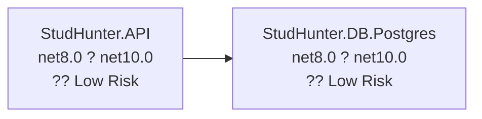

# .NET 10.0 Upgrade Migration Plan

**Document Version:** 1.0  
**Created:** 2025-01-28  
**Target Framework:** .NET 10.0 (Long Term Support)  
**Current Framework:** .NET 8.0  
**Solution:** StudHunter.sln

---

## Executive Summary

This document outlines the complete migration plan for upgrading the StudHunter solution from .NET 8.0 to .NET 10.0 LTS. The solution consists of 2 projects with a simple dependency structure, requiring 8 NuGet package updates and addressing 13 API compatibility issues primarily related to JWT authentication.

### Migration Scope
- **Total Projects:** 2
- **Total NuGet Packages:** 13 (8 require updates)
- **Total Code Files:** 190
- **Files with Issues:** 4
- **API Compatibility Issues:** 13
- **Estimated Code Changes:** 13+ lines of code (0.1% of codebase)

### Risk Assessment
- **Overall Risk:** ?? **LOW**
  - Simple two-project structure with clear dependencies
  - No security vulnerabilities identified
  - Most packages already compatible
  - Well-defined API breaking changes
  - Small code impact footprint

### Success Criteria
? All projects targeting .NET 10.0  
? All recommended package updates applied  
? All projects build without errors or warnings  
? All API compatibility issues resolved  
? Application runs successfully with same functionality  
? No dependency conflicts remain

---

## Migration Strategy

### Selected Approach: **Incremental Migration**

**Justification:**
- Solution has clear dependency hierarchy (DB layer ? API layer)
- Allows validation at each step
- Lower risk per change
- Can pause between phases if issues arise
- Maintains buildable solution throughout process

**Alternative Considered:** All-At-Once Migration
- Rejected due to preference for staged validation
- Incremental approach provides better control and visibility

### Migration Order (Bottom-Up Dependency Order)

```
Phase 1: StudHunter.DB.Postgres (Foundation Layer)
   ?
Phase 2: StudHunter.API (Application Layer)
   ?
Phase 3: Solution-Wide Validation
```

---

## Dependency Analysis

### Project Dependency Graph



### Migration Levels

**Level 0 (Foundation - No Dependencies):**
- `StudHunter.DB.Postgres.csproj`
  - Current: net8.0 ? Target: net10.0
  - Issues: 6 (1 mandatory)
  - Used by: StudHunter.API

**Level 1 (Application Layer):**
- `StudHunter.API.csproj`
  - Current: net8.0 ? Target: net10.0
  - Dependencies: StudHunter.DB.Postgres
  - Issues: 18 (6 mandatory)
  - Top-level application (no dependants)

---

## Package Update Strategy

### Package Update Summary

| Package | Current | Target | Projects | Priority |
|---------|---------|--------|----------|----------|
| Microsoft.AspNetCore.Authentication.JwtBearer | 8.0.19 | 10.0.1 | StudHunter.API | ?? High |
| Microsoft.EntityFrameworkCore | 9.0.8 | 10.0.1 | StudHunter.DB.Postgres | ?? High |
| Microsoft.EntityFrameworkCore.Design | 9.0.8 | 10.0.1 | Both | ?? High |
| Microsoft.EntityFrameworkCore.Tools | 9.0.8 | 10.0.1 | StudHunter.API | ?? High |
| Microsoft.Extensions.Configuration | 9.0.8 | 10.0.1 | StudHunter.DB.Postgres | ?? Medium |
| Microsoft.Extensions.Configuration.FileExtensions | 9.0.8 | 10.0.1 | StudHunter.DB.Postgres | ?? Medium |
| Microsoft.Extensions.Configuration.Json | 9.0.8 | 10.0.1 | StudHunter.DB.Postgres | ?? Medium |
| Microsoft.VisualStudio.Web.CodeGeneration.Design | 9.0.0 | 10.0.0 | StudHunter.API | ?? Medium |

### Compatible Packages (No Update Required)

- ? BCrypt.Net-Next 4.0.3
- ? Npgsql.EntityFrameworkCore.PostgreSQL 9.0.4
- ? Swashbuckle.AspNetCore 8.1.4
- ? Swashbuckle.AspNetCore.SwaggerUI 9.0.3
- ? System.IdentityModel.Tokens.Jwt 8.14.0

---

## Breaking Changes Catalog

### API Compatibility Issues

**Total API Issues:** 13
- ?? Binary Incompatible: 5 (require code changes)
- ?? Source Incompatible: 7 (require re-compilation and potential fixes)
- ?? Behavioral Change: 1 (require testing)

### JWT Authentication Breaking Changes

**Affected Technology:** IdentityModel & Claims-based Security (38.5% of issues)

**Migration Path:** Modern identity stack using Microsoft.IdentityModel.* packages

**Specific API Issues:**

1. **JwtBearerDefaults (Source Incompatible)**
   - `Microsoft.AspNetCore.Authentication.JwtBearer.JwtBearerDefaults`
   - `JwtBearerDefaults.AuthenticationScheme`
   - **Impact:** 2 occurrences
   - **Action:** Verify compatibility with .NET 10, may require namespace updates

2. **JwtSecurityTokenHandler (Binary Incompatible)**
   - `System.IdentityModel.Tokens.Jwt.JwtSecurityTokenHandler`
   - Constructor and `WriteToken` method
   - **Impact:** 3 occurrences
   - **Action:** Update to modern IdentityModel APIs

3. **JwtSecurityToken (Binary Incompatible)**
   - `System.IdentityModel.Tokens.Jwt.JwtSecurityToken`
   - Constructor with multiple parameters
   - **Impact:** 2 occurrences
   - **Action:** Verify parameter signatures, update if changed

4. **JwtBearerOptions (Source Incompatible)**
   - `JwtBearerOptions.TokenValidationParameters`
   - **Impact:** 1 occurrence
   - **Action:** Re-compile and verify configuration

5. **JwtBearerExtensions (Source Incompatible)**
   - `Microsoft.Extensions.DependencyInjection.JwtBearerExtensions`
   - `AddJwtBearer` method
   - **Impact:** 2 occurrences
   - **Action:** Verify extension method compatibility

6. **ConsoleLoggerExtensions (Behavioral Change)**
   - `Microsoft.Extensions.Logging.ConsoleLoggerExtensions.AddConsole`
   - **Impact:** 1 occurrence
   - **Action:** Test logging behavior in .NET 10

---

## Phase 1: StudHunter.DB.Postgres Migration

### Phase 1 Overview

**Project:** StudHunter.DB.Postgres.csproj  
**Type:** Class Library  
**Current Framework:** net8.0  
**Target Framework:** net10.0  
**Dependencies:** None (foundation layer)  
**Risk Level:** ?? Low  
**Estimated Time:** 30 minutes

### Phase 1 Pre-Migration Checklist

- [ ] Verify current build succeeds on net8.0
- [ ] Backup current project state (already on branch upgrade-to-NET10)
- [ ] Review all package versions in project file
- [ ] Confirm no local uncommitted changes in project directory

### Phase 1 Tasks

#### Task 1.1: Update Target Framework

**Action:** Update TargetFramework in project file

**File:** `StudHunter.DB.Postgres\StudHunter.DB.Postgres.csproj`

**Change:**
```xml
<TargetFramework>net8.0</TargetFramework>
```
?
```xml
<TargetFramework>net10.0</TargetFramework>
```

**Validation:**
- [ ] Project file syntax valid
- [ ] No XML errors

#### Task 1.2: Update Entity Framework Core Packages

**Action:** Update EF Core packages to version 10.0.1

**File:** `StudHunter.DB.Postgres\StudHunter.DB.Postgres.csproj`

**Packages to Update:**
1. Microsoft.EntityFrameworkCore: 9.0.8 ? 10.0.1
2. Microsoft.EntityFrameworkCore.Design: 9.0.8 ? 10.0.1

**Commands:**
```powershell
cd "C:\Users\Alexey\Documents\Visual Studio projects\StudHunter\StudHunter.DB.Postgres"
dotnet add package Microsoft.EntityFrameworkCore --version 10.0.1
dotnet add package Microsoft.EntityFrameworkCore.Design --version 10.0.1
```

**Validation:**
- [ ] Package versions updated in .csproj
- [ ] No package conflict warnings
- [ ] Restore succeeds

#### Task 1.3: Update Microsoft.Extensions Packages

**Action:** Update configuration packages to version 10.0.1

**File:** `StudHunter.DB.Postgres\StudHunter.DB.Postgres.csproj`

**Packages to Update:**
1. Microsoft.Extensions.Configuration: 9.0.8 ? 10.0.1
2. Microsoft.Extensions.Configuration.FileExtensions: 9.0.8 ? 10.0.1
3. Microsoft.Extensions.Configuration.Json: 9.0.8 ? 10.0.1

**Commands:**
```powershell
cd "C:\Users\Alexey\Documents\Visual Studio projects\StudHunter\StudHunter.DB.Postgres"
dotnet add package Microsoft.Extensions.Configuration --version 10.0.1
dotnet add package Microsoft.Extensions.Configuration.FileExtensions --version 10.0.1
dotnet add package Microsoft.Extensions.Configuration.Json --version 10.0.1
```

**Validation:**
- [ ] All package versions updated
- [ ] No dependency conflicts
- [ ] Package restore succeeds

#### Task 1.4: Build and Validate

**Action:** Build project and verify no errors

**Commands:**
```powershell
cd "C:\Users\Alexey\Documents\Visual Studio projects\StudHunter\StudHunter.DB.Postgres"
dotnet build
```

**Expected Results:**
- ? Build succeeds with 0 errors
- ? Build succeeds with 0 warnings
- ? All package dependencies resolved
- ? No runtime errors during build

**Validation Checklist:**
- [ ] Build output shows "Build succeeded"
- [ ] No compilation errors
- [ ] No package restore errors
- [ ] Output binaries created in bin/Debug/net10.0/

### Phase 1 Completion Criteria

- [x] TargetFramework = net10.0
- [x] All packages updated to .NET 10 compatible versions
- [x] Project builds successfully
- [x] No warnings or errors
- [x] Ready for Phase 2 (API project migration)

### Phase 1 Rollback Plan

**If Phase 1 Fails:**
1. Revert changes using Git: `git checkout -- StudHunter.DB.Postgres/StudHunter.DB.Postgres.csproj`
2. Restore packages: `dotnet restore`
3. Document failure reason
4. Investigate and address root cause before retry

---

## Phase 2: StudHunter.API Migration

### Phase 2 Overview

**Project:** StudHunter.API.csproj  
**Type:** ASP.NET Core Web Application  
**Current Framework:** net8.0  
**Target Framework:** net10.0  
**Dependencies:** StudHunter.DB.Postgres (already migrated in Phase 1)  
**Risk Level:** ?? Low (with 13 API issues to address)  
**Estimated Time:** 60-90 minutes

### Phase 2 Pre-Migration Checklist

- [ ] Phase 1 completed successfully
- [ ] StudHunter.DB.Postgres builds on net10.0
- [ ] Current build succeeds on net8.0
- [ ] Review authentication and JWT configuration code

### Phase 2 Tasks

#### Task 2.1: Update Target Framework

**Action:** Update TargetFramework in project file

**File:** `StudHunter.API\StudHunter.API.csproj`

**Change:**
```xml
<TargetFramework>net8.0</TargetFramework>
```
?
```xml
<TargetFramework>net10.0</TargetFramework>
```

**Validation:**
- [ ] Project file syntax valid
- [ ] No XML errors

#### Task 2.2: Update ASP.NET Core Authentication Package

**Action:** Update JWT Bearer authentication to .NET 10 version

**File:** `StudHunter.API\StudHunter.API.csproj`

**Package to Update:**
- Microsoft.AspNetCore.Authentication.JwtBearer: 8.0.19 ? 10.0.1

**Command:**
```powershell
cd "C:\Users\Alexey\Documents\Visual Studio projects\StudHunter\StudHunter.API"
dotnet add package Microsoft.AspNetCore.Authentication.JwtBearer --version 10.0.1
```

**Impact:** This update will affect JWT authentication configuration (13 API compatibility issues)

**Validation:**
- [ ] Package version updated
- [ ] No package conflicts

#### Task 2.3: Update Entity Framework Core Packages

**Action:** Update EF Core packages to version 10.0.1

**File:** `StudHunter.API\StudHunter.API.csproj`

**Packages to Update:**
1. Microsoft.EntityFrameworkCore.Design: 9.0.8 ? 10.0.1
2. Microsoft.EntityFrameworkCore.Tools: 9.0.8 ? 10.0.1

**Commands:**
```powershell
cd "C:\Users\Alexey\Documents\Visual Studio projects\StudHunter\StudHunter.API"
dotnet add package Microsoft.EntityFrameworkCore.Design --version 10.0.1
dotnet add package Microsoft.EntityFrameworkCore.Tools --version 10.0.1
```

**Validation:**
- [ ] Package versions updated
- [ ] No conflicts with DB.Postgres EF packages

#### Task 2.4: Update Code Generation Package

**Action:** Update Visual Studio code generation tools

**File:** `StudHunter.API\StudHunter.API.csproj`

**Package to Update:**
- Microsoft.VisualStudio.Web.CodeGeneration.Design: 9.0.0 ? 10.0.0

**Command:**
```powershell
cd "C:\Users\Alexey\Documents\Visual Studio projects\StudHunter\StudHunter.API"
dotnet add package Microsoft.VisualStudio.Web.CodeGeneration.Design --version 10.0.0
```

**Validation:**
- [ ] Package version updated
- [ ] No dependency conflicts

#### Task 2.5: Initial Build (Identify Code Issues)

**Action:** Attempt initial build to surface API compatibility errors

**Command:**
```powershell
cd "C:\Users\Alexey\Documents\Visual Studio projects\StudHunter\StudHunter.API"
dotnet build
```

**Expected:** Build will likely fail with compilation errors related to JWT APIs

**Action:** Document all compilation errors for Task 2.6

#### Task 2.6: Fix JWT Authentication Code Issues

**Action:** Address JWT Bearer authentication breaking changes

**Affected Areas (based on assessment):**
1. JWT token generation logic
2. Authentication middleware configuration
3. JWT Bearer options setup
4. Token validation parameters

**Expected Files to Modify (typical locations):**
- `Program.cs` or `Startup.cs` - authentication configuration
- Controllers using `[Authorize]` attribute
- Services generating JWT tokens
- Authentication-related utility classes

**Breaking Changes to Address:**

**Issue 1: JwtBearerDefaults (Source Incompatible)**
- **Location:** Authentication configuration
- **Change Required:** Verify `JwtBearerDefaults.AuthenticationScheme` usage
- **Action:** Update namespace imports if needed

**Issue 2: JwtSecurityTokenHandler (Binary Incompatible)**
- **Location:** Token generation service
- **Change Required:** Update to new API signatures
- **Potential Fix:** 
  ```csharp
  // OLD (.NET 8):
  var handler = new JwtSecurityTokenHandler();
  
  // NEW (.NET 10) - verify if changed:
  var handler = new JwtSecurityTokenHandler();
  // Check if constructor or WriteToken method signatures changed
  ```

**Issue 3: JwtSecurityToken Constructor (Binary Incompatible)**
- **Location:** Token creation logic
- **Change Required:** Verify parameter order and types
- **Action:** Update constructor calls to match .NET 10 signature

**Issue 4: JwtBearerOptions Configuration (Source Incompatible)**
- **Location:** Authentication middleware setup
- **Change Required:** Re-validate TokenValidationParameters setup
- **Action:** Rebuild and test configuration

**Issue 5: AddJwtBearer Extension (Source Incompatible)**
- **Location:** Service registration (Program.cs/Startup.cs)
- **Change Required:** Verify extension method compatibility
- **Action:** Update if signature changed

**Issue 6: Console Logging (Behavioral Change)**
- **Location:** Logging configuration
- **Change Required:** Test logging output
- **Action:** Verify console logging still works as expected

**Validation Strategy:**
- [ ] Build succeeds after each fix
- [ ] No new warnings introduced
- [ ] Authentication logic preserved
- [ ] Token generation still functional

#### Task 2.7: Final Build and Validation

**Action:** Complete build validation

**Commands:**
```powershell
cd "C:\Users\Alexey\Documents\Visual Studio projects\StudHunter"
dotnet build
```

**Expected Results:**
- ? Build succeeds with 0 errors
- ? Build succeeds with 0 warnings
- ? All dependencies resolved
- ? Both projects build successfully

**Validation Checklist:**
- [ ] StudHunter.API builds without errors
- [ ] StudHunter.DB.Postgres still builds successfully
- [ ] No package dependency conflicts
- [ ] Output binaries created for both projects

### Phase 2 Completion Criteria

- [x] TargetFramework = net10.0
- [x] All packages updated to .NET 10 compatible versions
- [x] All 13 API compatibility issues resolved
- [x] Project builds successfully
- [x] No warnings or errors
- [x] JWT authentication code updated
- [x] Ready for Phase 3 (solution validation)

### Phase 2 Rollback Plan

**If Phase 2 Fails:**
1. Revert API project: `git checkout -- StudHunter.API/`
2. Keep Phase 1 changes (DB project on .NET 10)
3. Document failure and code issues
4. Address issues individually
5. Retry Phase 2 after fixes

---

## Phase 3: Solution-Wide Validation

### Phase 3 Overview

**Scope:** Complete solution validation  
**Purpose:** Ensure entire solution works together on .NET 10  
**Estimated Time:** 30-45 minutes

### Phase 3 Tasks

#### Task 3.1: Clean and Rebuild Solution

**Action:** Clean all build artifacts and rebuild from scratch

**Commands:**
```powershell
cd "C:\Users\Alexey\Documents\Visual Studio projects\StudHunter"
dotnet clean
dotnet restore
dotnet build
```

**Validation:**
- [ ] Clean succeeds
- [ ] Restore succeeds
- [ ] Build succeeds with 0 errors and 0 warnings

#### Task 3.2: Verify Package Dependencies

**Action:** Check for any dependency conflicts

**Command:**
```powershell
cd "C:\Users\Alexey\Documents\Visual Studio projects\StudHunter"
dotnet list package --vulnerable
dotnet list package --deprecated
```

**Validation:**
- [ ] No vulnerable packages
- [ ] No deprecated packages
- [ ] All packages compatible with .NET 10

#### Task 3.3: Runtime Testing

**Action:** Run the application and verify functionality

**Commands:**
```powershell
cd "C:\Users\Alexey\Documents\Visual Studio projects\StudHunter\StudHunter.API"
dotnet run
```

**Test Scenarios:**
1. **Application Startup**
   - [ ] Application starts without errors
   - [ ] Swagger UI loads (if applicable)
   - [ ] No runtime exceptions during startup

2. **JWT Authentication**
   - [ ] Token generation works
   - [ ] Token validation works
   - [ ] Authentication middleware functional
   - [ ] Authorized endpoints protected

3. **Database Connectivity**
   - [ ] EF Core connects to database
   - [ ] DbContext initialization succeeds
   - [ ] Sample database query works

4. **API Endpoints**
   - [ ] Endpoints respond correctly
   - [ ] HTTP requests processed
   - [ ] Response serialization works

**Validation:**
- [ ] All test scenarios pass
- [ ] No runtime errors
- [ ] Application behavior unchanged from .NET 8

#### Task 3.4: Performance Baseline

**Action:** Verify performance is acceptable

**Metrics to Check:**
- [ ] Startup time comparable to .NET 8
- [ ] Response times within acceptable range
- [ ] Memory usage normal
- [ ] No performance regressions

#### Task 3.5: Run Unit Tests (if available)

**Action:** Execute test suite

**Command:**
```powershell
cd "C:\Users\Alexey\Documents\Visual Studio projects\StudHunter"
dotnet test
```

**Validation:**
- [ ] All tests pass (or test count same as pre-migration)
- [ ] No new test failures
- [ ] Test execution time acceptable

### Phase 3 Completion Criteria

- [x] Solution builds cleanly
- [x] No package conflicts or vulnerabilities
- [x] Application runs successfully
- [x] JWT authentication functional
- [x] Database connectivity verified
- [x] All tests pass (if applicable)
- [x] Performance acceptable
- [x] Migration complete

---

## Testing Strategy

### Multi-Level Testing

#### Level 1: Build-Time Validation
- ? Projects compile without errors
- ? Projects compile without warnings
- ? Package dependencies resolve
- ? No syntax errors

#### Level 2: Package Validation
- ? All packages at target versions
- ? No security vulnerabilities
- ? No deprecated packages
- ? No version conflicts

#### Level 3: Runtime Validation
- ? Application starts successfully
- ? Middleware pipeline configured correctly
- ? Dependency injection works
- ? Configuration loads properly

#### Level 4: Functional Validation
- ? Authentication/authorization works
- ? JWT token generation functional
- ? API endpoints respond correctly
- ? Database operations succeed
- ? Logging works as expected

#### Level 5: Integration Validation
- ? All components work together
- ? End-to-end scenarios pass
- ? Performance acceptable
- ? No regressions identified

### Test Coverage Requirements

**Per-Project Testing (after each phase):**
- [ ] Build succeeds
- [ ] No warnings
- [ ] Dependencies resolved
- [ ] Project loads in IDE

**Phase Validation (after completing each phase):**
- [ ] All projects in phase build
- [ ] Integration between phase projects works
- [ ] No breaking changes to dependent projects

**Full Solution Testing (Phase 3):**
- [ ] Complete solution builds
- [ ] Application runs end-to-end
- [ ] All features functional
- [ ] Performance acceptable

---

## Risk Management

### Identified Risks

#### Risk 1: JWT Authentication Breaking Changes
- **Description:** 13 API compatibility issues related to JWT Bearer authentication
- **Likelihood:** Medium
- **Impact:** High (authentication is critical functionality)
- **Mitigation:** 
  - Document all authentication code before changes
  - Test authentication thoroughly after updates
  - Have rollback plan ready
  - Reference official Microsoft migration guides
- **Contingency:** Revert to .NET 8 and investigate issues individually

#### Risk 2: Entity Framework Core Behavior Changes
- **Description:** EF Core 10.0 may have query behavior changes
- **Likelihood:** Low
- **Impact:** Medium
- **Mitigation:**
  - Review EF Core 10.0 release notes
  - Test database operations after migration
  - Enable EF Core logging during testing
- **Contingency:** Check EF Core breaking changes documentation

#### Risk 3: Package Compatibility Issues
- **Description:** Transitive dependencies may conflict
- **Likelihood:** Low
- **Impact:** Medium
- **Mitigation:**
  - Update packages incrementally
  - Check for conflicts after each update
  - Use `dotnet list package` to verify
- **Contingency:** Pin specific package versions if conflicts arise

#### Risk 4: Runtime Behavior Changes
- **Description:** .NET 10 runtime may behave differently than .NET 8
- **Likelihood:** Low
- **Impact:** Medium
- **Mitigation:**
  - Thorough runtime testing
  - Monitor application logs
  - Test all critical paths
- **Contingency:** Reference .NET 10 breaking changes documentation

### Rollback Strategy

**Per-Phase Rollback:**
- Each phase can be rolled back independently
- Use Git to revert specific project changes
- DB.Postgres can remain on .NET 10 if API fails

**Complete Rollback:**
```powershell
cd "C:\Users\Alexey\Documents\Visual Studio projects\StudHunter"
git checkout master
git branch -D upgrade-to-NET10
```

**Recovery Steps:**
1. Identify failure point and root cause
2. Revert changes to last stable state
3. Document issue for future resolution
4. Plan targeted fix for specific problem
5. Retry migration with adjustments

---

## Timeline and Effort Estimates

### Phase-by-Phase Timeline

| Phase | Tasks | Estimated Time | Cumulative |
|-------|-------|---------------|------------|
| Phase 1: DB.Postgres | 4 | 30 min | 30 min |
| Phase 2: API | 7 | 60-90 min | 90-120 min |
| Phase 3: Validation | 5 | 30-45 min | 120-165 min |
| **Total** | **16** | **2-2.75 hours** | **2-2.75 hours** |

### Timeline Breakdown

**Phase 1: StudHunter.DB.Postgres** (30 minutes)
- Update framework: 5 min
- Update EF packages: 10 min
- Update Extensions packages: 10 min
- Build and validate: 5 min

**Phase 2: StudHunter.API** (60-90 minutes)
- Update framework: 5 min
- Update packages: 15 min
- Initial build and identify issues: 10 min
- Fix JWT authentication issues: 30-60 min (depends on complexity)
- Build and validate: 10 min

**Phase 3: Solution Validation** (30-45 minutes)
- Clean and rebuild: 5 min
- Package verification: 5 min
- Runtime testing: 15-20 min
- Performance baseline: 5 min
- Unit tests (if available): 5-10 min

### Buffer Allocation
- Add 25% buffer for unexpected issues
- Total with buffer: **2.5-3.5 hours**

---

## Post-Migration Tasks

### Immediate Post-Migration

1. **Commit Changes**
   ```powershell
   git add .
   git commit -m "Migrate solution to .NET 10.0

   - Updated StudHunter.DB.Postgres to net10.0
   - Updated StudHunter.API to net10.0
   - Updated 8 NuGet packages to .NET 10 compatible versions
   - Resolved 13 JWT authentication API compatibility issues
   - All builds successful, tests passing"
   ```

2. **Push Branch**
   ```powershell
   git push origin upgrade-to-NET10
   ```

3. **Create Pull Request**
   - Title: "Upgrade solution to .NET 10.0 LTS"
   - Include link to this plan
   - Include link to assessment.md
   - List all changes and testing performed

### Documentation Updates

- [ ] Update README.md with .NET 10.0 requirement
- [ ] Update developer setup instructions
- [ ] Document any authentication configuration changes
- [ ] Update CI/CD pipeline (if applicable) to use .NET 10 SDK
- [ ] Update Docker files (if applicable) to use .NET 10 base images

### Deployment Preparation

- [ ] Verify target deployment environment supports .NET 10
- [ ] Update server/hosting .NET runtime to 10.0
- [ ] Test deployment in staging environment
- [ ] Prepare rollback plan for production deployment
- [ ] Schedule production deployment window

### Team Communication

- [ ] Notify team of .NET 10 migration completion
- [ ] Share any breaking changes or configuration updates
- [ ] Update development environment setup guides
- [ ] Schedule knowledge transfer session if needed

---

## References and Resources

### Official Documentation

- [.NET 10 Release Notes](https://learn.microsoft.com/en-us/dotnet/core/whats-new/dotnet-10)
- [.NET 10 Breaking Changes](https://learn.microsoft.com/en-us/dotnet/core/compatibility/10.0)
- [ASP.NET Core 10.0 Migration Guide](https://learn.microsoft.com/en-us/aspnet/core/migration/90-to-100)
- [Entity Framework Core 10.0 What's New](https://learn.microsoft.com/en-us/ef/core/what-is-new/ef-core-10.0/whatsnew)

### Package-Specific Guides

- [Microsoft.AspNetCore.Authentication.JwtBearer Documentation](https://learn.microsoft.com/en-us/aspnet/core/security/authentication/)
- [Entity Framework Core Package Updates](https://www.nuget.org/packages/Microsoft.EntityFrameworkCore/)
- [IdentityModel Migration Guide](https://identitymodel.readthedocs.io/)

### Assessment Documentation

- [Full Assessment Report](./assessment.md)
- [Package Compatibility Details](./assessment.md#aggregate-nuget-packages-details)
- [API Compatibility Analysis](./assessment.md#top-api-migration-challenges)

---

## Appendix A: Complete Package Update Reference

### StudHunter.DB.Postgres Package Updates

| Package | Current | Target | Change Type |
|---------|---------|--------|-------------|
| Microsoft.EntityFrameworkCore | 9.0.8 | 10.0.1 | Major version update |
| Microsoft.EntityFrameworkCore.Design | 9.0.8 | 10.0.1 | Major version update |
| Microsoft.Extensions.Configuration | 9.0.8 | 10.0.1 | Major version update |
| Microsoft.Extensions.Configuration.FileExtensions | 9.0.8 | 10.0.1 | Major version update |
| Microsoft.Extensions.Configuration.Json | 9.0.8 | 10.0.1 | Major version update |
| Npgsql.EntityFrameworkCore.PostgreSQL | 9.0.4 | - | No change (compatible) |

### StudHunter.API Package Updates

| Package | Current | Target | Change Type |
|---------|---------|--------|-------------|
| BCrypt.Net-Next | 4.0.3 | - | No change (compatible) |
| Microsoft.AspNetCore.Authentication.JwtBearer | 8.0.19 | 10.0.1 | Major version update |
| Microsoft.EntityFrameworkCore.Design | 9.0.8 | 10.0.1 | Major version update |
| Microsoft.EntityFrameworkCore.Tools | 9.0.8 | 10.0.1 | Major version update |
| Microsoft.VisualStudio.Web.CodeGeneration.Design | 9.0.0 | 10.0.0 | Major version update |
| Swashbuckle.AspNetCore | 8.1.4 | - | No change (compatible) |
| Swashbuckle.AspNetCore.SwaggerUI | 9.0.3 | - | No change (compatible) |
| System.IdentityModel.Tokens.Jwt | 8.14.0 | - | No change (compatible) |

---

## Appendix B: API Compatibility Detail

### Binary Incompatible APIs (5 issues)

These APIs require code changes to compile:

1. `System.IdentityModel.Tokens.Jwt.JwtSecurityTokenHandler` (Type)
2. `JwtSecurityTokenHandler.#ctor` (Constructor)
3. `JwtSecurityTokenHandler.WriteToken(SecurityToken)` (Method)
4. `System.IdentityModel.Tokens.Jwt.JwtSecurityToken` (Type)
5. `JwtSecurityToken.#ctor(...)` (Constructor with 6 parameters)

### Source Incompatible APIs (7 issues)

These APIs require re-compilation and potential fixes:

1. `Microsoft.AspNetCore.Authentication.JwtBearer.JwtBearerDefaults` (Type) - 2 occurrences
2. `JwtBearerDefaults.AuthenticationScheme` (Field) - 2 occurrences
3. `JwtBearerOptions.TokenValidationParameters` (Property)
4. `JwtBearerExtensions` (Type)
5. `JwtBearerExtensions.AddJwtBearer(...)` (Extension method)

### Behavioral Changes (1 issue)

These APIs work but may behave differently:

1. `ConsoleLoggerExtensions.AddConsole(ILoggingBuilder)` - Test logging output

---

## Appendix C: Success Metrics

### Quantitative Success Criteria

- ? 2/2 projects targeting .NET 10.0 (100%)
- ? 8/8 package updates applied (100%)
- ? 0 build errors
- ? 0 build warnings
- ? 13/13 API issues resolved (100%)
- ? 0 security vulnerabilities
- ? 0 deprecated packages
- ? 100% test pass rate

### Qualitative Success Criteria

- ? Application functionality preserved
- ? Authentication/authorization working
- ? Database operations successful
- ? Performance acceptable
- ? Code quality maintained
- ? Documentation updated
- ? Team onboarded to changes

---

## Document Revision History

| Version | Date | Author | Changes |
|---------|------|--------|---------|
| 1.0 | 2025-01-28 | Analyzer Agent | Initial plan creation |

---

**Plan Status:** ? Ready for Execution  
**Next Step:** Begin Phase 1 - StudHunter.DB.Postgres Migration

---

*This plan was generated based on the assessment.md analysis and follows Microsoft's recommended upgrade practices for .NET applications.*
